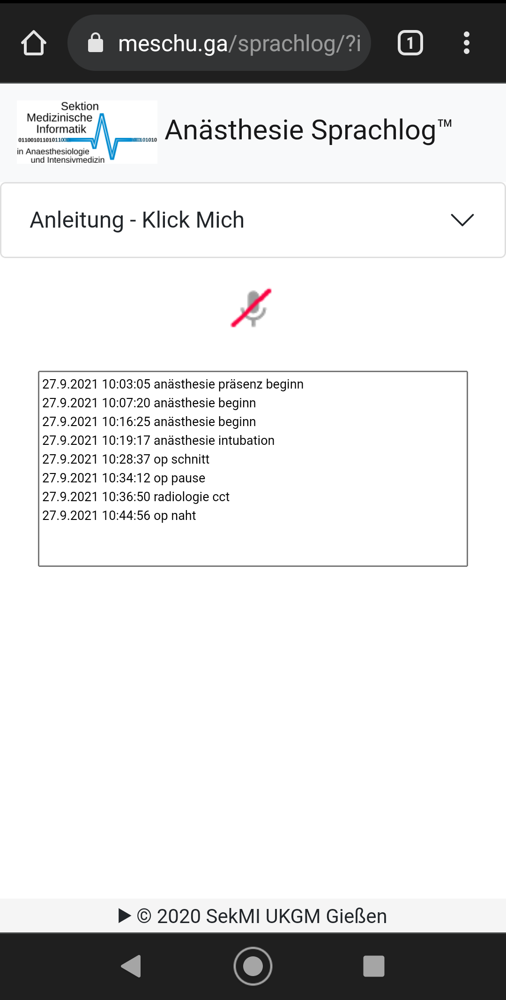

# Anästhesie Sprachlog

Erfassung anästhesierelevanter Zeitmarker mittels Spracherkennung.

## Live DEMO: https://meschu.ga/sprachlog

### Voraussetzungen

* Chrome Browser (Android, MAC, PC)
* Internetverbindung
* Mikrofonzugriff durch den User

### Hosting

* SSL zwingend erforderlich (sonst ständig Mikrofonanfragen!)
* Bootstrap via CDN

